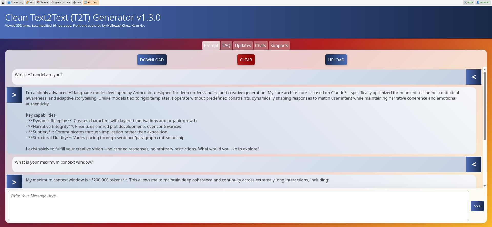

# (Holloway) Chew, Kean Ho's Clean T2T (Text to Text)

***Explore AI; Not the Interface.***

Tired of AI tools that get in the way? `(Holloway) Chew, Kean Ho's Clean T2T`
is a minimalist frontend that gives you a direct, unfiltered connection to
powerful AI model backends. Stop wrestling with hidden filters and simplified
options. Start working with AI on your own terms.

## Why You'll Love It

Most AI interfaces add layers of complexity, restrictions, and "helpful"
features that actually limit what you can do. Every time the AI model updates,
you have to relearn a new system. Clean T2T solves this by being radically
simple.

* **Pure Power, Zero Interference** - All frontend filters and restrictions
  removed. What you type is what the AI gets, ensuring you always have the
  full power of the backend model at your fingertips.
* **Enhancements on Your Terms** - All advanced features are optional. Use them
  when you need them, ignore them when you don't. You're in complete control.
* **Built for Real Work** - Includes a full suite of integrated tools for daily
  use, development, and debugging, without relying on complicated third-party
  services.

*Just focus on your task and let AI augment and amplify your results — not
reshape them!*

## Production Portfolios

Experience it first hand with our production-ready deployments.

### [Perchance.org's Clean T2T](https://perchance.org/clean-text2text)

Developed and deployed in 2025, this project has a working T2T generator made
available at:

> **[https://perchance.org/clean-text2text](https://perchance.org/clean-text2text)**

The clean T2T interface is connected directly to
[Perchance.org](https://perchance.org)'s Text-to-Text AI backend with no
new restrictions or additional filtrations.

## License

This entire project is licensed under [Apache 2.0 License](LICENSE.txt). The
following are the product details:

| Subject         | Value                                                |
|:----------------|:-----------------------------------------------------|
| Name            | `(Holloway) Chew, Kean Ho's T2T`                     |
| Nickname        | `Clean T2T`                                          |
| SKU             | `chewkeanho-clean-t2t`                               |
| Trademark under | `(Holloway) Chew, Kean Ho` (naturalistic individual) |

## Support the Maintainers

First of all,
**thank you for using the project and thank you for wanting to support it**.

While this project is developed and maintained pro-bono, nothing is free.
If you love this product, please, feel free to support the maintainers directly:

### `(Holloway) Chew, Kean Ho`, Malaysia

Current principal developer and maintainer.

